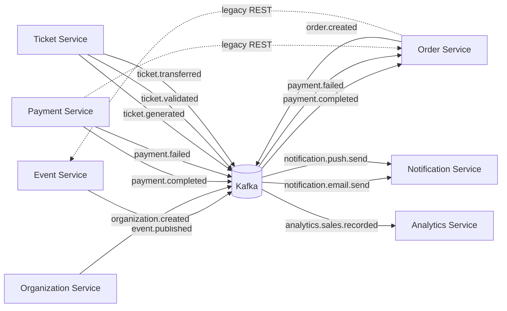

# Service Interaction (Kafka-first)

## Architecture Diagram


## Responsibilities Matrix
| Service | Main Responsibilities |
|---|---|
| `event-service` | Event CRUD, promo codes, ticket-category price/availability + reserve/release |
| `order-service` | Create orders, reserve/release via ticket-category endpoints, order lifecycle (PENDING/CONFIRMED/CANCELLED/...) |
| `organization-service` | Organization CRUD + subscription checks (`can-create-event`, `increment-event-count`) |
| `payment-service` | Process payments with mock gateway, publish `payment.completed` / `payment.failed` events |
| `ticket-service` | Ticket generation, QR validation, transfer, and cancellation |
| `notification-service` | Consume notification events and send email/push |
| `analytics-service` | Consume analytics events and persist analytics aggregates |
| `user-service` | User/auth endpoints + centralized API error handling |

## Kafka Topics & Current Consumer Flow
| Topic | Producer | Consumers (current) |
|---|---|---|
| `event.published` | `event-service` | None in repo yet |
| `order.created` | `order-service` | None in repo yet |
| `organization.created` | `organization-service` | None in repo yet |
| `ticket.generated` | `ticket-service` | None in repo yet |
| `ticket.validated` | `ticket-service` | None in repo yet |
| `ticket.transferred` | `ticket-service` | None in repo yet |
| `payment.completed` | `payment-service` | `order-service` (confirms order) |
| `payment.failed` | `payment-service` | `order-service` (cancels order + releases reservations) |
| `notification.email.send` | Not implemented in repo | `notification-service` |
| `notification.push.send` | Not implemented in repo | `notification-service` |
| `analytics.sales.recorded` | Not implemented in repo | `analytics-service` |

## Event Publishing/Consuming Flow (publisher → topic → consumer)
1. `payment-service` publishes `PaymentCompletedEvent` to `payment.completed`
2. `order-service` consumes it via `@KafkaListener` and runs `confirmOrder(orderId)`
3. If payment fails, `payment-service` publishes `PaymentFailedEvent` to `payment.failed`
4. `order-service` consumes it and runs `cancelOrder(orderId)` (includes reserved-ticket release via ticket-category endpoints)

## Message Schemas (JSON)
Kafka uses Spring Kafka JSON serialization of the shared payload classes in `shared/kafka-events`.

### `PaymentCompletedEvent` (`payment.completed`)
```json
{
  "paymentId": "UUID",
  "orderId": "UUID",
  "userId": "UUID",
  "amount": "BigDecimal",
  "currency": "String",
  "paymentMethod": "String",
  "providerPaymentId": "String",
  "paidAt": "LocalDateTime",
  "eventId": "String"
}
```

### `PaymentFailedEvent` (`payment.failed`)
```json
{
  "paymentId": "UUID",
  "orderId": "UUID",
  "userId": "UUID",
  "amount": "BigDecimal",
  "currency": "String",
  "failureReason": "String",
  "failedAt": "LocalDateTime",
  "eventId": "String"
}
```

### `SendEmailEvent` (`notification.email.send`) and `SendPushEvent` (`notification.push.send`)
Notification payloads are consumed by `notification-service`, but **no producer is currently wired** in this repo.

### `SalesRecordedEvent` (`analytics.sales.recorded`)
`analytics-service` consumes this event, but **no producer is currently wired** in this repo.

## Local Setup (Docker Compose)
Prerequisites:
 - Docker + Docker Compose plugin

Run:
```bash
docker compose up -d
```

Then verify:
 - Kafka reachable at `kafka:9092` from containers and `localhost:9092` (plus `29092`) from host
 - Postgres available on `5432`
 - Keycloak available on `8180`

Notes / known gaps in this repo:
 - `docker-compose.yml` includes `organization-service` and `ticket-service`, and the API Gateway routes for:
   - `/api/organizations/**`, `/api/subscriptions/**`
   - `/api/tickets/**`, `/api/validate/**`
   are enabled and point to the corresponding services.

## Troubleshooting
 - Kafka listener not firing:
   - Check that consumer group-id is configured (e.g., `order-service`)
   - Ensure JSON deserializer trusted packages include `*` (already set for `order-service`)
 - Event deserialization failures:
   - Confirm producer and consumer share the same payload classes from `shared/kafka-events`
 - Topics not created:
   - Kafka auto-create is enabled in `docker-compose.yml` (`KAFKA_AUTO_CREATE_TOPICS_ENABLE: "true"`)
   - Shared `KafkaTopicsConfig` also provides `NewTopic` beans (requires component scanning of `com.tisqra.*`, which is enabled in service entrypoints)
 - Order creation fails due to missing ticket-category endpoints:
   - Ensure `event-service` is running and ticket-category endpoints exist under `/api/ticket-categories/**`

